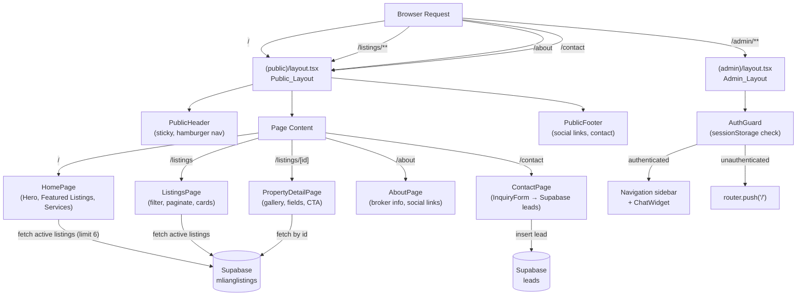

# Design Document: Public Website

## Overview

This document describes the technical design for adding a public-facing website to the M. Liang Realty (RealtyProv1) Next.js 14 application. The existing app is an internal property management system; this feature adds a customer-accessible section — public property browsing, inquiry submission, SEO infrastructure, and social media integration — without replacing or disrupting the existing admin functionality.

The approach uses Next.js 14 App Router **route groups** to split the app into two distinct trees with separate layouts:

- `(public)` — zero-auth public pages at `/`, `/listings`, `/listings/[id]`, `/about`, `/contact`
- `(admin)` — all existing management pages moved to `/admin/**`, gated by `Auth_Guard`

The root `app/layout.tsx` becomes a minimal shell (fonts, Analytics, globals.css only). Each route group provides its own layout, eliminating the current problem of the admin `Navigation` sidebar and `ChatWidget` appearing on every page.

---

## Architecture

### Route Group Structure

```
app/
├── layout.tsx                   ← Root layout (fonts, Analytics, globals.css only — NO Navigation/ChatWidget)
├── (public)/                    ← Route group: public pages, no auth
│   ├── layout.tsx               ← Public_Layout (PublicHeader + PublicFooter, no admin sidebar)
│   ├── page.tsx                 ← / (homepage)
│   ├── listings/
│   │   ├── page.tsx             ← /listings
│   │   └── [id]/
│   │       └── page.tsx         ← /listings/[id]
│   ├── about/
│   │   └── page.tsx             ← /about
│   └── contact/
│       └── page.tsx             ← /contact
├── (admin)/                     ← Route group: protected pages, Auth_Guard required
│   ├── layout.tsx               ← Admin_Layout (existing Navigation sidebar + ChatWidget)
│   └── admin/
│       ├── page.tsx             ← /admin (Dashboard)
│       ├── broker-dashboard/page.tsx
│       ├── properties/page.tsx
│       ├── rentals/page.tsx
│       ├── brokers/page.tsx
│       ├── agents/page.tsx
│       ├── agent-profile/page.tsx
│       ├── settings/page.tsx
│       ├── facebook-posts/
│       │   ├── page.tsx
│       │   └── add/page.tsx
│       ├── upload/page.tsx
│       └── editor/page.tsx
├── api/                         ← Existing API routes (unchanged)
└── sitemap.ts                   ← Next.js sitemap generator (App Router)
```

> **Route group naming**: Parenthesized folder names like `(public)` and `(admin)` are Next.js route group conventions — they are stripped from the URL. Pages inside `(public)` resolve to their natural paths (`/`, `/listings`, etc.). Pages inside `(admin)/admin/` resolve to `/admin/**`.


### High-Level Architecture Diagram




---

## Components and Interfaces

### Component Hierarchy

```
(public)/layout.tsx — Public_Layout
├── PublicHeader
│   ├── Logo / business name (from tenantSettings SSR fallback)
│   ├── DesktopNav (links: Home, Listings, About, Contact)
│   ├── ContactUsButton (→ /contact)
│   └── MobileMenuToggle
│       └── MobileNavDrawer (conditional)
├── {children}  ← page content slot
└── PublicFooter
    ├── BrandBlock (name + tagline)
    ├── SocialLinks (conditional per NEXT_PUBLIC_SOCIAL_*)
    ├── ContactBlock (address, phone, email, PRC)
    └── AdminLoginLink (→ /admin)

(admin)/layout.tsx — Admin_Layout
├── AuthGuard (client component, runs sessionStorage check)
│   ├── LoadingSpinner (while evaluating)
│   ├── Navigation (existing sidebar, unchanged)
│   ├── ChatWidget (existing, unchanged)
│   └── {children}  ← admin page content slot

Shared (public) page components:
├── ListingCard         — property summary card for /listings grid
├── ImageGallery        — scrollable photo carousel for /listings/[id]
├── InquiryForm         — lead-capture form for /contact
├── SocialLinks         — icon row, conditional per env vars
└── JsonLd              — injects <script type="application/ld+json">
```

### PublicHeader

```typescript
// app/(public)/components/PublicHeader.tsx
'use client'

interface PublicHeaderProps {
  businessName: string
}

// State:
// - mobileMenuOpen: boolean
// - hasMounted: boolean (for hydration-safe businessName)

// Behavior:
// - Sticky: class="sticky top-0 z-50 bg-white shadow-sm"
// - DesktopNav: hidden on <768px, flex on ≥768px
// - MobileMenuToggle: visible on <768px (hamburger → X icon toggle)
// - MobileNavDrawer: renders when mobileMenuOpen=true, closes on link click
// - businessName: passed as prop from server layout (tenantSettings fallback)
// - Active link: usePathname() to apply active style
```

### PublicFooter

```typescript
// app/(public)/components/PublicFooter.tsx
// Server Component (no 'use client' needed — reads env vars at build time)

interface PublicFooterProps {
  settings: TenantSettings  // passed from layout server component
}

// Social links conditionally rendered: only when env var is non-empty string
// Copyright year: new Date().getFullYear() evaluated server-side
// Admin Login link: always visible, links to /admin
```


### ListingCard

```typescript
// app/(public)/components/ListingCard.tsx
// Server Component (pure display, no interactivity needed)

interface ListingCardProps {
  listing: PublicListing
}

// Renders:
// - Preview photo (Next.js <Image> with placeholder="blur") or placeholder SVG
// - Property type badge
// - Location (Village + Location fields)
// - Price formatted as ₱X,XXX,XXX (Intl.NumberFormat 'en-PH', PHP)
// - Lot area in sqm
// - "View Details" link → /listings/[displayId]
//
// displayId calculation (preserves existing admin logic):
//   displayId = propertyId > 2 ? propertyId - 1 : propertyId
```

### ImageGallery

```typescript
// app/(public)/components/ImageGallery.tsx
'use client'

interface ImageGalleryProps {
  photos: string[]       // array of photo URLs
  alt: string            // base alt text (indexed: "Property photo 1 of N")
}

// State: activeIndex: number
// Renders horizontal scroll of thumbnails + large active photo
// Keyboard: ArrowLeft/ArrowRight navigation
// Fallback: if photos.length === 0, renders placeholder graphic
// Uses Next.js <Image> with unoptimized={true} for external Supabase URLs
```

### InquiryForm

```typescript
// app/(public)/components/InquiryForm.tsx
'use client'

interface InquiryFormProps {
  initialPropertyOfInterest?: string  // decoded from ?property= query param
  contactNumber: string               // from tenantSettings, for error message
}

// Fields:
//   fullName: string (required, max 100)
//   contactNumber: string (required, /^09\d{9}$/)
//   email: string (required, email format, max 150)
//   propertyOfInterest: string (optional, max 200, pre-filled from prop)
//   message: string (required, max 1000)
//
// State: FormState { values, errors, status: 'idle'|'loading'|'success'|'error', errorMsg }
//
// Validation: runs on submit before any Supabase call
// Submit flow:
//   1. Validate all fields → display inline errors if invalid, return
//   2. Set status='loading', disable submit button
//   3. await supabase.from('leads').insert({ ...values, created_at: new Date().toISOString() })
//   4a. Success → status='success', reset all fields
//   4b. Error → status='error', errorMsg set, fields retained
```

### AuthGuard

```typescript
// app/(admin)/components/AuthGuard.tsx
'use client'

// Runs as the first client component inside Admin_Layout
// State: authState: 'loading' | 'authenticated' | 'unauthenticated'
//
// useEffect (runs once, client-only):
//   try {
//     const auth = sessionStorage.getItem('brokerAdminAuth')
//     setAuthState(auth === 'authenticated' ? 'authenticated' : 'unauthenticated')
//   } catch {
//     // sessionStorage unavailable (private browsing blocked storage)
//     setAuthState('unauthenticated')
//   }
//
// Render logic:
//   'loading'         → <LoadingSpinner /> (prevents flash of protected content)
//   'unauthenticated' → useEffect calls router.push('/'), render null
//   'authenticated'   → render {children}
```


### SocialLinks

```typescript
// app/(public)/components/SocialLinks.tsx
// Server Component — reads env vars at render time

interface SocialLink {
  platform: 'facebook' | 'instagram' | 'tiktok' | 'youtube' | 'viber' | 'whatsapp'
  url: string
  icon: React.ReactNode
  label: string
}

// getSocialLinks(): SocialLink[]
// Reads NEXT_PUBLIC_SOCIAL_FACEBOOK, NEXT_PUBLIC_SOCIAL_INSTAGRAM, etc.
// Returns only entries where the env var is a non-empty string
// All rendered anchors: target="_blank" rel="noopener noreferrer"
```

### JsonLd

```typescript
// app/(public)/components/JsonLd.tsx
// Server Component

interface JsonLdProps {
  data: Record<string, unknown>
}

// Renders: <script type="application/ld+json" dangerouslySetInnerHTML={{ __html: JSON.stringify(data) }} />
// Usage:
//   Homepage: LocalBusiness schema
//   Property Detail: RealEstateListing schema (requirement 4.5)
```

---

## Data Models

### Supabase Tables

#### `mlianglistings` (existing — read-only from public site)

The existing table uses inconsistent column naming (spaces, mixed case). The public site reads via the existing Supabase client and normalises at the component level. Key columns accessed:

| Column Name | Type | Notes |
|---|---|---|
| `property_id` | number | Primary key; used for routing (displayId = id > 2 ? id-1 : id) |
| `Status` | string | Filter: `=== 'active'` (case-insensitive) |
| `Type` | string | Property type (residential, lot, commercial) |
| `Location` | string | City/area |
| `Village` | string | Subdivision name |
| `Listing Price` | string/number | Raw value; parsed by formatPrice() |
| `Lot Area` / `Lot Area sqm` / `LA` | string/number | Normalised at component level |
| `Floor Area` / `Floor Area sqm` | string/number | Optional |
| `Bedroom` | string/number | Optional |
| `Bathroom` | string/number | Optional |
| `Preview Photo` | string | URL for thumbnail/og:image |
| `Photo 1` … `Photo N` | string | Gallery URLs |
| `Notes` | string | Property description |


#### `leads` (new table — Supabase migration required)

```sql
CREATE TABLE leads (
  id           BIGSERIAL PRIMARY KEY,
  full_name    TEXT NOT NULL CHECK (char_length(full_name) <= 100),
  contact_number TEXT NOT NULL CHECK (contact_number ~ '^09[0-9]{9}$'),
  email        TEXT NOT NULL CHECK (char_length(email) <= 150),
  property_of_interest TEXT CHECK (char_length(property_of_interest) <= 200),
  message      TEXT NOT NULL CHECK (char_length(message) <= 1000),
  created_at   TIMESTAMPTZ NOT NULL DEFAULT now()
);

-- RLS: Allow anonymous insert (public inquiry form), deny select/update/delete
ALTER TABLE leads ENABLE ROW LEVEL SECURITY;
CREATE POLICY "Allow public insert" ON leads FOR INSERT TO anon WITH CHECK (true);
```

### TypeScript Interfaces

```typescript
// lib/types/public.ts

export interface PublicListing {
  id: number
  displayId: number          // id > 2 ? id - 1 : id
  type: string
  location: string
  village?: string
  price: number | null
  lotArea: number | null
  floorArea: number | null
  bedrooms: number | null
  bathrooms: number | null
  previewPhoto: string | null
  photos: string[]
  notes: string
  status: string
  updatedAt?: string
}

export interface TenantSettings {
  businessName: string
  brokerName: string
  brokerTitle: string
  prcNumber: string
  officeAddress: string
  contactNumber: string
  emailAddress: string
}

export const TENANT_DEFAULTS: TenantSettings = {
  businessName:  'M. Liang Realty',
  brokerName:    'M. Liang',
  brokerTitle:   'Licensed Real Estate Broker',
  prcNumber:     '0019653',
  officeAddress: 'S10, 2nd Floor Plaza Cristina Building, Dolores, City of San Fernando, Pampanga',
  contactNumber: '09393440944',
  emailAddress:  'contact@realtyprov1.com',
}

export interface LeadInsert {
  full_name: string
  contact_number: string
  email: string
  property_of_interest?: string
  message: string
  created_at: string   // ISO 8601 UTC
}

export interface SocialConfig {
  facebook?:  string
  instagram?: string
  tiktok?:    string
  youtube?:   string
  viber?:     string
  whatsapp?:  string
}
```


### Data Flow

#### Public Homepage (`/`)

```
(public)/page.tsx  [Server Component]
  │
  ├── getTenantSettingsServer()          ← reads TENANT_DEFAULTS (no localStorage on server)
  │                                        localStorage is client-only; SSR uses hardcoded defaults
  │
  └── supabase.from('mlianglistings')
        .select('*')
        .ilike('Status', 'active')       ← case-insensitive match
        .order('property_id', { ascending: false })
        .limit(6)
      → listings[]  → <ListingCard> × min(6, listings.length)
```

#### Listings Page (`/listings`)

```
(public)/listings/page.tsx  [Server Component — initial render]
  │
  └── supabase.from('mlianglistings')
        .select('*')
        .ilike('Status', 'active')
        .order('property_id', { ascending: false })
      → allListings[]  → passed to ListingsClientWrapper

ListingsClientWrapper  [Client Component]
  │
  ├── Receives allListings[] as prop (no client-side Supabase fetch)
  ├── Local filter state: { type, locationQuery, priceRange }
  ├── filteredListings = useMemo(() => applyFilters(allListings, filters), [allListings, filters])
  ├── currentPage: reset to 1 on any filter change
  └── paginatedListings = filteredListings.slice((page-1)*12, page*12)
```

> **Design decision**: Fetch all active listings server-side once and filter client-side. This avoids additional Supabase round-trips per filter change and keeps the public page fast. The active listings dataset is expected to be manageable in size (<500 records). For large datasets, server-side filtering with URL search params could be added later.

#### Property Detail (`/listings/[id]`)

```
(public)/listings/[id]/page.tsx  [Server Component]
  │
  ├── params.id → displayId (number)
  ├── internalId = displayId >= 2 ? displayId + 1 : displayId  (reverse of admin logic)
  └── supabase.from('mlianglistings')
        .select('*')
        .eq('property_id', internalId)
        .single()
      → listing | null
      → null: render "Property not found" + link to /listings
      → found: render full detail page
```

#### Contact Form (`/contact`) — Lead Insertion

```
InquiryForm [Client Component]
  │
  ├── 1. Client-side validation (no network)
  │      contactNumber: /^09\d{9}$/.test(value)
  │      email: /^[^\s@]+@[^\s@]+\.[^\s@]+$/.test(value)  (RFC 5322 approximate)
  │      lengths: name≤100, email≤150, propertyOfInterest≤200, message≤1000
  │
  ├── 2. If valid: supabase.from('leads').insert([{
  │        full_name, contact_number, email,
  │        property_of_interest, message,
  │        created_at: new Date().toISOString()
  │      }])
  │
  ├── 3a. Success: setStatus('success'), reset all fields
  └── 3b. Error: setStatus('error'), set errorMsg, retain field values
```


---

## SEO Implementation

### Next.js Metadata API

Each public page exports a `metadata` object (static pages) or a `generateMetadata` function (dynamic pages):

```typescript
// app/(public)/page.tsx — Homepage
export const metadata: Metadata = {
  title: 'M. Liang Realty – Houses, Lots & Condos in Pampanga',  // 52 chars
  description: 'Browse house and lot, commercial properties, and lot-only listings in Pampanga. M. Liang Realty, licensed broker PRC No. 0019653.',  // 130 chars
  openGraph: {
    title: 'M. Liang Realty – Houses, Lots & Condos in Pampanga',
    description: '...',
    images: [{ url: '/og-image.jpg', width: 1200, height: 630 }],
    url: 'https://realtyprov1.com',
    type: 'website',
  },
  twitter: {
    card: 'summary_large_image',
    title: '...',
    description: '...',
    images: ['/og-image.jpg'],
  },
  alternates: { canonical: 'https://realtyprov1.com' },
}
```

```typescript
// app/(public)/listings/[id]/page.tsx — Dynamic detail page
export async function generateMetadata({ params }: Props): Promise<Metadata> {
  const listing = await fetchListingById(params.id)
  if (!listing) return { title: 'Property Not Found – M. Liang Realty' }

  const title = `${listing.type} in ${listing.location} – M. Liang Realty`
  const description = listing.notes.slice(0, 157) + (listing.notes.length > 157 ? '...' : '')

  return {
    title,
    description,
    openGraph: { images: listing.previewPhoto ? [listing.previewPhoto] : [] },
    alternates: { canonical: `https://realtyprov1.com/listings/${listing.displayId}` },
  }
}
```

### Sitemap

```typescript
// app/sitemap.ts  (Next.js App Router convention → served at /sitemap.xml)
import type { MetadataRoute } from 'next'

export default async function sitemap(): Promise<MetadataRoute.Sitemap> {
  const { data: listings } = await supabase
    .from('mlianglistings')
    .select('property_id, updated_at')
    .ilike('Status', 'active')

  const staticRoutes: MetadataRoute.Sitemap = [
    { url: 'https://realtyprov1.com/',         lastModified: new Date(), changeFrequency: 'weekly', priority: 1.0 },
    { url: 'https://realtyprov1.com/listings', lastModified: new Date(), changeFrequency: 'weekly', priority: 0.9 },
    { url: 'https://realtyprov1.com/about',    lastModified: new Date(), changeFrequency: 'monthly', priority: 0.7 },
    { url: 'https://realtyprov1.com/contact',  lastModified: new Date(), changeFrequency: 'monthly', priority: 0.8 },
  ]

  const listingRoutes = (listings ?? []).map(l => {
    const displayId = l['property_id'] > 2 ? l['property_id'] - 1 : l['property_id']
    return {
      url: `https://realtyprov1.com/listings/${displayId}`,
      lastModified: l.updated_at ? new Date(l.updated_at) : new Date(),
      changeFrequency: 'weekly' as const,
      priority: 0.8,
    }
  })

  return [...staticRoutes, ...listingRoutes]
}
```

### Robots.txt

```typescript
// app/robots.ts  (Next.js App Router convention → served at /robots.txt)
import type { MetadataRoute } from 'next'

export default function robots(): MetadataRoute.Robots {
  return {
    rules: [
      {
        userAgent: '*',
        allow: ['/', '/listings', '/listings/', '/about', '/contact'],
        disallow: ['/admin/', '/api/'],
      },
    ],
    sitemap: 'https://realtyprov1.com/sitemap.xml',
  }
}
```

### JSON-LD Structured Data

```typescript
// lib/seo/jsonld.ts

export function buildLocalBusinessJsonLd(settings: TenantSettings): object {
  return {
    '@context': 'https://schema.org',
    '@type': 'RealEstateAgent',
    name: settings.businessName,
    telephone: settings.contactNumber,
    email: settings.emailAddress,
    url: 'https://realtyprov1.com',
    address: {
      '@type': 'PostalAddress',
      streetAddress: settings.officeAddress,
      addressLocality: 'San Fernando',
      addressRegion: 'Pampanga',
      addressCountry: 'PH',
    },
  }
}

export function buildRealEstateListingJsonLd(listing: PublicListing): object {
  return {
    '@context': 'https://schema.org',
    '@type': 'RealEstateListing',
    name: `${listing.type} in ${listing.location}`,
    description: listing.notes,
    url: `https://realtyprov1.com/listings/${listing.displayId}`,
    image: listing.previewPhoto ?? undefined,
    offers: {
      '@type': 'Offer',
      price: listing.price ?? undefined,
      priceCurrency: 'PHP',
      availability: 'https://schema.org/InStock',
    },
  }
}
```


### Social Media Configuration Utility

```typescript
// lib/social.ts

export type SocialPlatform = 'facebook' | 'instagram' | 'tiktok' | 'youtube' | 'viber' | 'whatsapp'

export interface SocialLinkConfig {
  platform: SocialPlatform
  url: string
  label: string
}

const ENV_MAP: Record<SocialPlatform, string | undefined> = {
  facebook:  process.env.NEXT_PUBLIC_SOCIAL_FACEBOOK,
  instagram: process.env.NEXT_PUBLIC_SOCIAL_INSTAGRAM,
  tiktok:    process.env.NEXT_PUBLIC_SOCIAL_TIKTOK,
  youtube:   process.env.NEXT_PUBLIC_SOCIAL_YOUTUBE,
  viber:     process.env.NEXT_PUBLIC_SOCIAL_VIBER,
  whatsapp:  process.env.NEXT_PUBLIC_SOCIAL_WHATSAPP,
}

/**
 * Returns only platforms whose env var is configured (non-empty string).
 * Pure function — safe to call from Server Components and unit tests.
 */
export function getConfiguredSocialLinks(): SocialLinkConfig[] {
  return (Object.entries(ENV_MAP) as [SocialPlatform, string | undefined][])
    .filter(([, url]) => typeof url === 'string' && url.trim().length > 0)
    .map(([platform, url]) => ({
      platform,
      url: url!.trim(),
      label: platform.charAt(0).toUpperCase() + platform.slice(1),
    }))
}
```

### tenantSettings Server Helper

```typescript
// lib/tenant.ts

import { TenantSettings, TENANT_DEFAULTS } from './types/public'

/**
 * Server-side: always returns hardcoded defaults.
 * localStorage is not available during SSR.
 * Client components that need live settings read from localStorage directly.
 */
export function getTenantSettingsServer(): TenantSettings {
  return { ...TENANT_DEFAULTS }
}

/**
 * Client-side hook for reading tenantSettings from localStorage.
 * Returns defaults immediately (for SSR/hydration), then updates after mount.
 */
export function useTenantSettings(): TenantSettings {
  // Implementation: useState(TENANT_DEFAULTS) + useEffect that reads localStorage
  // and calls JSON.parse(localStorage.getItem('tenantSettings') || '{}')
  // merges with TENANT_DEFAULTS: { ...TENANT_DEFAULTS, ...parsed }
}
```


---

## Correctness Properties

*A property is a characteristic or behavior that should hold true across all valid executions of a system — essentially, a formal statement about what the system should do. Properties serve as the bridge between human-readable specifications and machine-verifiable correctness guarantees.*

---

### Property 1: Auth_Guard always redirects unauthenticated users from admin routes

*For any* `/admin/**` path and any sessionStorage state that is not `brokerAdminAuth === 'authenticated'` (including missing key, wrong value, or exception), rendering the AuthGuard component SHALL call `router.push('/')` and SHALL NOT render the protected page content.

**Validates: Requirements 1.3, 9.2, 9.3**

---

### Property 2: Public pages perform no authentication checks

*For any* public page path (`/`, `/listings`, `/listings/[id]`, `/about`, `/contact`), rendering that page SHALL NOT invoke `sessionStorage.getItem` at any point, regardless of the visitor's authentication state.

**Validates: Requirements 1.4**

---

### Property 3: Featured listings obey the "up to 6, newest first" invariant

*For any* dataset of N active listings, the homepage Featured Listings section SHALL display exactly `min(N, 6)` listing cards, and the displayed listings SHALL be the ones with the N highest `property_id` values (i.e., the newest). If N = 0, the placeholder message SHALL be shown.

**Validates: Requirements 2.2, 2.3**

---

### Property 4: Social media icons appear if and only if their env var is configured

*For any* subset of {FACEBOOK, INSTAGRAM, TIKTOK, YOUTUBE, VIBER, WHATSAPP} having their `NEXT_PUBLIC_SOCIAL_*` env var set to a non-empty string, the SocialLinks component SHALL render an icon and anchor for exactly those platforms — no extra icons for unset vars, and no missing icons for set vars.

**Validates: Requirements 2.6, 10.1, 10.2**

---

### Property 5: Social links always open in a new tab with security attributes

*For any* social platform link that is rendered (its env var is non-empty), the anchor element SHALL have `target="_blank"` and `rel` containing both `"noopener"` and `"noreferrer"`.

**Validates: Requirements 10.3, 2.6, 8.2**

---

### Property 6: Listings page filter intersection is correct

*For any* dataset of active listings and any combination of filter values (type, locationQuery, priceRange), the displayed listings SHALL be exactly the subset of active listings that simultaneously satisfy ALL active filter predicates. No listing that fails any filter predicate SHALL appear, and no listing satisfying all predicates SHALL be hidden.

**Validates: Requirements 3.1, 3.4**

---

### Property 7: ListingCard renders all required visible fields for any listing

*For any* listing object with a valid `id`, `type`, `location`, `price`, and `status = 'active'`, the rendered ListingCard SHALL contain: the formatted price (₱ symbol), the location string, the property type, and a link whose href equals `/listings/${displayId}`. Optional fields (lot area, photo) SHALL be shown when present and omitted gracefully when absent.

**Validates: Requirements 3.2**

---

### Property 8: Pagination appears iff more than 12 listings match filters

*For any* count N of listings matching the current filter state, pagination controls SHALL be visible if and only if N > 12. When pagination is visible, the number of pages SHALL equal `Math.ceil(N / 12)`.

**Validates: Requirements 3.6**

---

### Property 9: Property detail page renders all non-null fields for any listing

*For any* listing record fetched from `mlianglistings`, the detail page SHALL display each field that is non-null/non-empty (type, location, price, lot area, floor area, bedrooms, bathrooms, notes, photos). Fields that are null or empty SHALL be omitted without causing a render error.

**Validates: Requirements 4.3**

---

### Property 10: Detail page title format is always "{Type} in {Location} – M. Liang Realty"

*For any* property type string T and location string L, `generateDetailTitle(T, L)` SHALL produce the string `"${T} in ${L} – M. Liang Realty"` with no truncation, extra spaces, or missing components.

**Validates: Requirements 4.5**

---

### Property 11: About/Contact pages display tenantSettings values with correct fallback

*For any* partial or complete `tenantSettings` object stored in localStorage, the About page and Contact page SHALL display each present field using the stored value (overriding the default), and each absent field using the corresponding value from `TENANT_DEFAULTS`. No field SHALL display `undefined` or `null`.

**Validates: Requirements 5.2, 6.8**

---

### Property 12: Contact number validation accepts exactly 11-digit strings starting with "09"

*For any* string input S, `validateContactNumber(S)` SHALL return `true` if and only if S matches the regular expression `/^09\d{9}$/` (i.e., exactly 11 characters: "09" followed by 9 digits). All other strings SHALL return `false`.

**Validates: Requirements 6.1**

---

### Property 13: Invalid form submissions never call the Supabase insert API

*For any* form state where at least one required field fails its validation rule (empty name, invalid contact number, invalid email, empty message), activating the submit control SHALL display inline error messages and SHALL NOT invoke `supabase.from('leads').insert(...)`.

**Validates: Requirements 6.6**

---

### Property 14: Valid form submissions insert correct data into Supabase leads table

*For any* valid form submission (all required fields satisfying their validation rules), `supabase.from('leads').insert(...)` SHALL be called exactly once with an object containing `full_name`, `contact_number`, `email`, `message`, and `created_at` matching the submitted values. The `created_at` SHALL be a valid ISO 8601 UTC timestamp string.

**Validates: Requirements 6.3**

---

### Property 15: Sitemap contains exactly the static pages plus one URL per active listing

*For any* dataset of active and inactive listings, the generated sitemap SHALL contain exactly 4 static URLs (`/`, `/listings`, `/about`, `/contact`) plus one `/listings/[displayId]` entry for each active listing — no entries for inactive listings, no duplicate entries.

**Validates: Requirements 7.1**

---

### Property 16: Canonical URL builder always produces a valid absolute URL

*For any* combination of a valid host string H and public path P, `buildCanonicalUrl(H, P)` SHALL produce a string that is a valid absolute URL matching the pattern `https://${H}${P}` with no double slashes, missing scheme, or missing host.

**Validates: Requirements 7.3**

---

### Property 17: LocalBusiness JSON-LD always contains all required schema fields

*For any* `TenantSettings` object, `buildLocalBusinessJsonLd(settings)` SHALL return an object with all of: `@context`, `@type` equal to `"RealEstateAgent"`, `name`, `telephone`, and `address` with sub-fields `addressLocality`, `addressRegion`, and `addressCountry`. No field SHALL be `undefined` or `null`.

**Validates: Requirements 7.4**

---

### Property 18: Public pages never render the admin Navigation sidebar or ChatWidget

*For any* public page path, rendering it via the `(public)` layout SHALL result in a DOM that does not contain the admin `Navigation` component (sidebar) or the `ChatWidget` component.

**Validates: Requirements 1.1, 8.5**


---

## Error Handling

### Supabase Query Failures

All Supabase reads on public pages use a consistent pattern:

```typescript
const { data, error } = await supabase.from('mlianglistings')...

if (error) {
  // Log server-side (never expose error details to browser)
  console.error('[public-website] Supabase error:', error.message)
  // Return safe fallback to client
  return <ListingsError />  // "Unable to load listings. Please try again later."
}
```

Error states per page:
| Page | Error state | Fallback UI |
|---|---|---|
| Homepage Featured Listings | Supabase query error | "Unable to load listings at this time" message, no grid |
| Homepage (0 results) | Empty data | "No listings available at the moment" placeholder |
| `/listings` | Supabase query error | "Unable to load listings. Please try again later." No filters, no pagination |
| `/listings/[id]` — not found | `.data === null` | "Property not found" + link to /listings |
| `/listings/[id]` — DB error | `error !== null` | "Unable to load this property. Please try again." |
| `/contact` submit | Supabase insert error | Inline: "Submission failed. Please try again or call us directly at {contactNumber}." Fields retained |

### Form Validation Errors

Inline validation messages appear immediately below each invalid field on submit attempt. Each error message is descriptive:

- Full Name (empty): "Full name is required."
- Contact Number (invalid): "Enter a valid 11-digit Philippine mobile number (e.g., 09XXXXXXXXX)."
- Email (invalid): "Enter a valid email address."
- Message (empty): "Message is required."
- Message (too long): "Message must be 1000 characters or fewer."

### Auth Guard Failure Mode

If `sessionStorage` access throws (blocked in private browsing), the `try/catch` in `AuthGuard` catches the exception and sets `authState = 'unauthenticated'`, triggering `router.push('/')`. This prevents an infinite loading state.

---

## Testing Strategy

### Unit Tests (Jest + React Testing Library)

The project already has Jest configured (`jest.config.js`, `jest.setup.js`). Tests live in `__tests__/` directories co-located with the code they test.

**Example-based tests cover:**
- Homepage hero section renders CTAs linking to correct routes
- Listings page filter controls are present in the DOM
- Contact page pre-fills "Property of Interest" from query param
- Auth Guard redirects unauthenticated users (mocked `next/navigation`)
- Auth Guard shows loading state before sessionStorage resolves
- Logout clears sessionStorage and calls `router.push('/')`
- Footer Admin Login link is present and links to `/admin`
- Mobile hamburger menu shows/hides nav on toggle

**Edge case tests cover:**
- Listings page: no matching filters → "No properties match" + Clear Filters button
- Homepage: 0 active listings → "No listings available" placeholder
- Property detail: non-existent id → "Property not found" + /listings link
- Contact form: Supabase error → error message with contact number, fields retained
- Auth Guard: sessionStorage throws exception → redirect to /

### Property-Based Tests (fast-check)

The project uses Jest. Add `fast-check` for property-based tests:

```
npm install --save-dev fast-check@3.22.0
```

Each property test runs a minimum of 100 iterations. Tests are tagged with the design property they validate.

```typescript
// __tests__/public/auth-guard.property.test.ts
// Feature: public-website, Property 1: Auth_Guard always redirects unauthenticated

import * as fc from 'fast-check'

test('Auth_Guard redirects for any non-authenticated sessionStorage state', () => {
  // Feature: public-website, Property 1: Auth_Guard always redirects unauthenticated
  fc.assert(
    fc.property(
      fc.oneof(
        fc.constant(null),                           // key absent
        fc.string().filter(s => s !== 'authenticated'), // wrong value
        fc.constant(undefined)
      ),
      (authValue) => {
        // mock sessionStorage.getItem to return authValue
        // render AuthGuard
        // assert router.push('/') was called
        // assert protected content not in DOM
      }
    ),
    { numRuns: 100 }
  )
})
```

Key property tests and their targets:

| Property | Test file | `numRuns` |
|---|---|---|
| P1: Auth_Guard redirects unauthenticated | `auth-guard.property.test.ts` | 100 |
| P2: Public pages no sessionStorage reads | `public-pages.property.test.ts` | 100 |
| P3: Featured listings ≤6, newest first | `home-listings.property.test.ts` | 200 |
| P4: Social icons iff env var set | `social-links.property.test.ts` | 200 |
| P5: Social links target/rel attributes | `social-links.property.test.ts` | 200 |
| P6: Filter intersection correctness | `listings-filter.property.test.ts` | 300 |
| P7: ListingCard renders required fields | `listing-card.property.test.ts` | 200 |
| P8: Pagination threshold | `listings-pagination.property.test.ts` | 200 |
| P9: Detail page non-null fields | `property-detail.property.test.ts` | 200 |
| P10: Detail title format | `seo-utils.property.test.ts` | 200 |
| P11: tenantSettings fallback | `tenant-settings.property.test.ts` | 200 |
| P12: Contact number validation | `form-validation.property.test.ts` | 500 |
| P13: Invalid form never calls Supabase | `inquiry-form.property.test.ts` | 200 |
| P14: Valid form inserts correct data | `inquiry-form.property.test.ts` | 200 |
| P15: Sitemap active listings only | `sitemap.property.test.ts` | 200 |
| P16: Canonical URL absolute | `seo-utils.property.test.ts` | 200 |
| P17: JSON-LD required fields | `seo-utils.property.test.ts` | 200 |
| P18: Public pages no admin components | `public-layout.property.test.ts` | 100 |

### Integration / Smoke Tests

- Smoke: Verify Supabase connection reaches `mlianglistings` table (1 query)
- Smoke: Verify `leads` table exists and allows anon insert
- Integration: Submit InquiryForm end-to-end with test data, verify row in leads table, then delete

### SEO Validation

- `generateMetadata` output tested for title length (50–70 chars), description length (150–160 chars)
- JSON-LD output validated against schema.org spec using `@markuplint/schema-rule-validation` or similar
- Sitemap XML structure validated with a simple XML parser test

